# Xamarin.Forms / .Net Core / Azure Notification Hubs を使用してプッシュ通知を実現する

Xamarin.Forms / .Net Core / Azure Notification Hubs を利用して、Android 端末と iOS 端末でプッシュ通知を受信できるモバイルアプリを作成します。このモバイルアプリでは、端末でテキストを入力して送信すると、アプリをインストールしているユーザに入力したテキストを通知します。

このサンプルを実施すると以下のことが分かるようになります。

- iOS 端末にプッシュ通知を送るために必要な環境構築を行う
- Android 端末にプッシュ通知を送るために必要な環境構築を行う
- Xamarin.Forms で開発したモバイルアプリでプッシュ通知を受信する

## アーキテクチャ

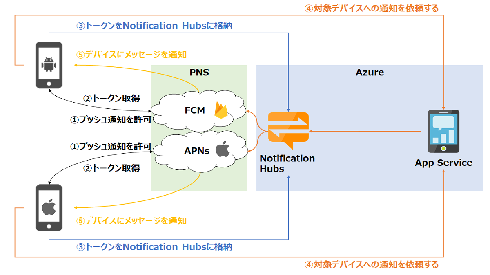

1. Push Notification Service からのモバイルアプリへのプッシュ通知を許可する
2. プッシュ通知のためのデバイストークンを取得する
3. デバイストークンを Azure Notification Hubs に格納する
4. Azure App Service に配置されている Web API よりメッセージの通知を依頼する
    - Azure App Service から Azure Notification Hubs へ通知を依頼する
    - Azure Notification Hubs から PNS へ通知を依頼する
5. モバイルアプリをインストールしている端末にメッセージが通知される

### サンプルアプリ採用技術

- Frontend
    - [Xamarin.Forms](https://docs.microsoft.com/ja-jp/xamarin/xamarin-forms/)
    - [NUnit](https://nunit.org/)
    - [Prism](https://prismlibrary.github.io/docs/xamarin-forms/Getting-Started.html)
    - [Reactive Property](https://github.com/runceel/ReactiveProperty)
- Backend
    - [ASP.NET Core](https://docs.microsoft.com/ja-jp/aspnet/core/)
    - [NUnit](https://nunit.org/)
- Cloud
    - [Azure App Service](https://azure.microsoft.com/ja-jp/services/app-service/)
    - [Azure Notification Hubs](https://azure.microsoft.com/ja-jp/services/notification-hubs/)
- Push Notification Service
    - [Firebase Cloud Messaging](https://firebase.google.com/docs/cloud-messaging/)
    - [Apple Push Notification Service](https://developer.apple.com/jp/documentation/NetworkingInternet/Conceptual/RemoteNotificationsPG/APNSOverview.html)

## プッシュ通知のための環境構築


### 1. Android 用の PNS を構築する（Firebase Cloud Messaging）

#### 必要な環境
- [Firebase](https://console.firebase.google.com/) にログインするための Google アカウント

#### Firebase Cloud Messaging を設定する
プッシュ通知は Firebase のサービスの一つである Firebase Cloud Messaging（FCM）を使用します。

１．Firebase コンソールへログインします。

２．プロジェクトを追加します。

３．[Android アプリにFirebase を追加] をクリックします。

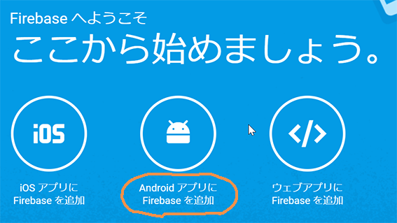

４．[Android パッケージ名] を入力して [アプリを登録] をクリックします。

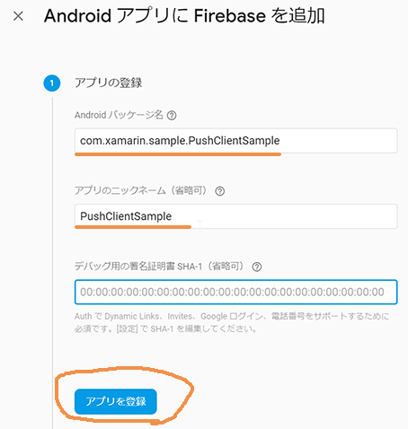

５．[google-services.json をダウンロード] をクリックします。このファイルはこの後のフロントエンドの設定で使用します。保存場所を忘れないようにしてください。 [次へ] をクリックします。

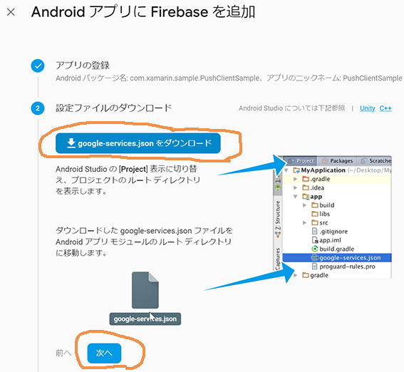

６．Firebase コンソールに戻り、環境設定から [プロジェクトの設定] をクリックします。

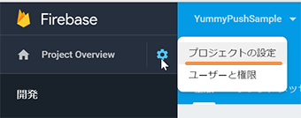

７．[クラウドメッセージング] タブの [以前のサーバーキー] をコピーします。この値を使用して Azure Notification Hubs との接続の構成をおこないます。忘れないように保存してください。

これで Firebase の構成は完了しました。


### 2. iOS 端末用の PNS を構築する（Apple Push Notification Service）

#### 必要な環境
- Mac パソコン（証明書を取得するために必要）
- [Apple Developer Program](https://developer.apple.com/jp/programs/) メンバーシップまたは [Apple Developer Enterprise Program](https://developer.apple.com/jp/programs/enterprise/) （企業向け）メンバーシップ

#### 証明書要求ファイルの生成
 署名済みのプッシュ証明書を生成するために、[Apple Developer Program](https://developer.apple.com/account/) を使用して証明書署名要求 (CSR: Certificate Signing Request) ファイルを生成します。

１．[キーチェーンアクセス] を起動し、[キーチェーンアクセス] → [証明書アシスタント] → [認証局に証明書を要求...] をクリックします。

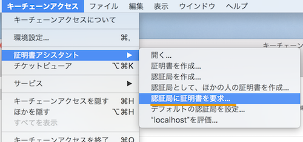

２．[ユーザのメールアドレス] と [通称] を入力（CAのメールアドレスは不要）後、 [ディスクに保存] をクリックしてデスクトップなど任意の場所に保存します。

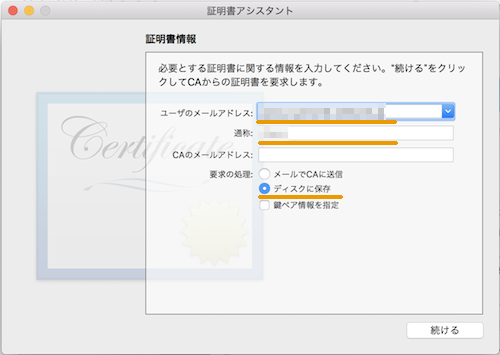

これで CSR ファイルが作成されました。保存した場所を忘れないようにしてください。

#### ADP によるアプリケーションの登録
次にアプリケーションの Bundle Identifier とプッシュ通知を Apple に登録します。

１．[Apple Developer Program](https://developer.apple.com/account/)（以下ADP）を開きます。

２．[Certificates, Identifier & Profiles] → [App IDs] → 右上の [+] をクリックします。

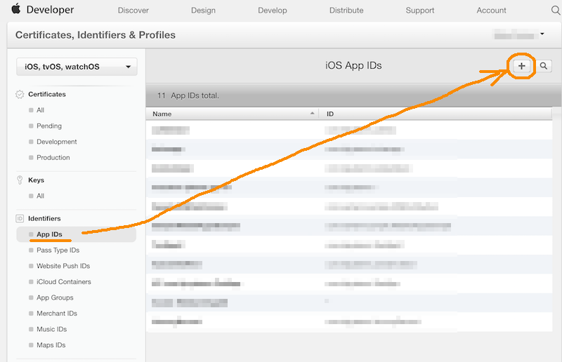

３．[App ID Description] セクションの [Name] に任意の名前を入力、[Explicit App ID] セクションの [Bundle ID] にバンドル識別子を入力します。

４．[App Services] セクションの [Push Notifications] をチェックします。

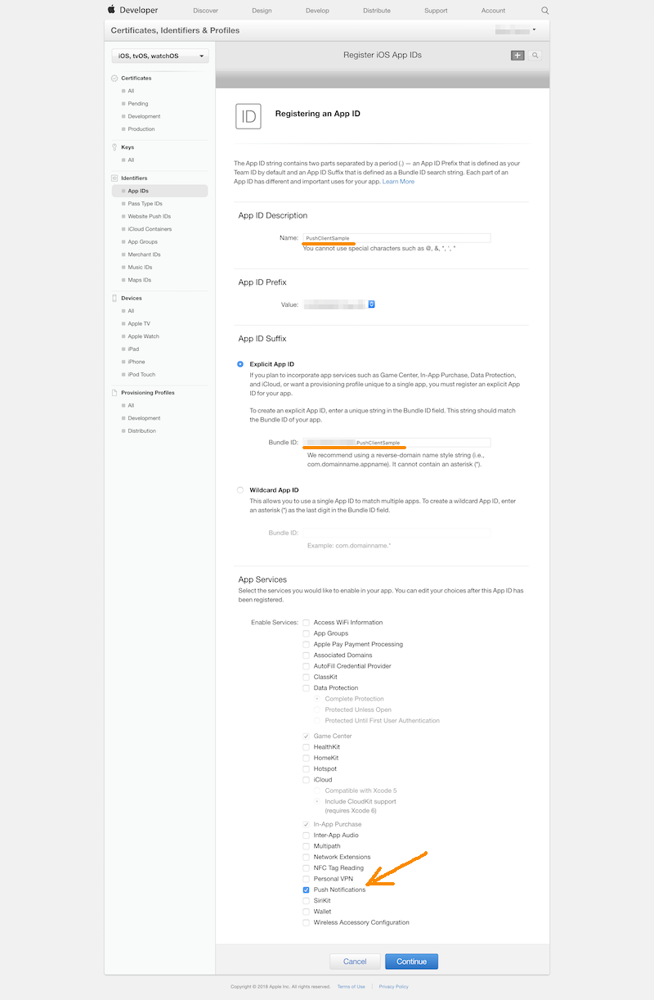

５． [Continue] をクリックして、新しいアプリケーション ID を確定します。

６．[Confirm App ID] で Push Notifications が Configurable（構成可能）であることを確認して [Register] をクリックします。

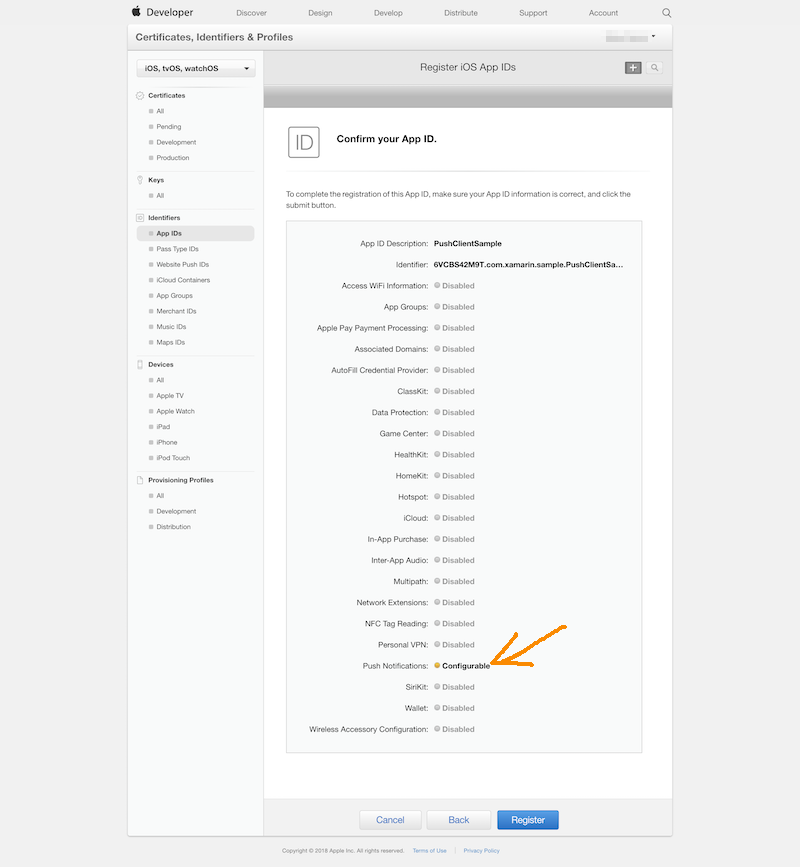

７．[App IDs] で登録されたアプリケーション ID をクリックします。

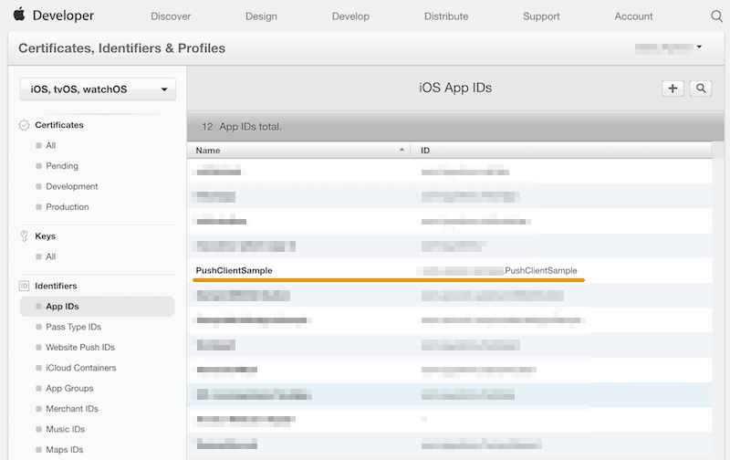

８．この時点ではまだ Push Notifications はオレンジ（Configurable）であることを確認して、 [Edit] をクリックします。

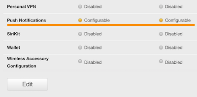

９．[Development Push SSL Certificate] （開発用）セクションの [Create Certificate] ボタンをクリックします。

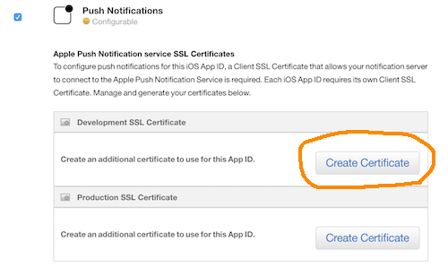

10．[Create] → [Continue] → [Choose File] をクリックして先ほど作成した CSR ファイルを指定し、[Continue] をクリックします。

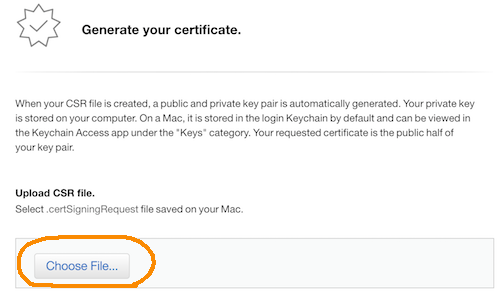

11．証明書が作成されたら [Download] ボタンをクリックし、[Done] をクリックします。

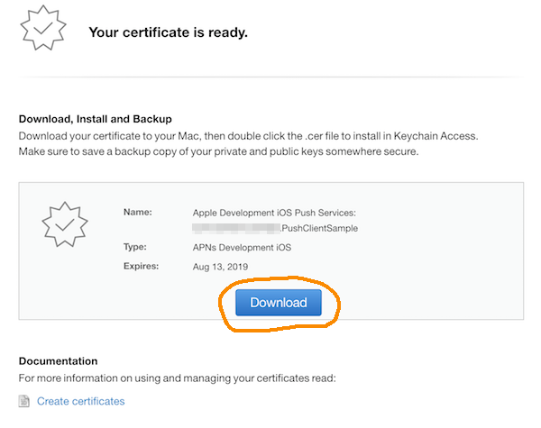

12．ダウンロードしたファイル（aps_development.cer）をダブルクリックします。

13．キーチェーンアクセスで証明書が登録されたことを確認します（Bundle Identifier の前に Apple Development iOS Push Services と付きます）。

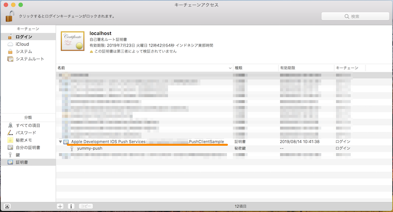

14．右クリックで証明書ファイル（p12）を書き出します。
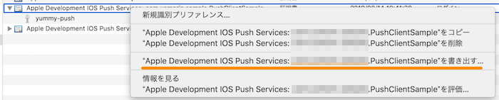

15．任意のフォルダに任意のファイル名で保存します。

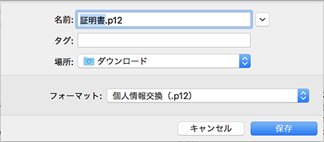

16．パスワードを設定します。

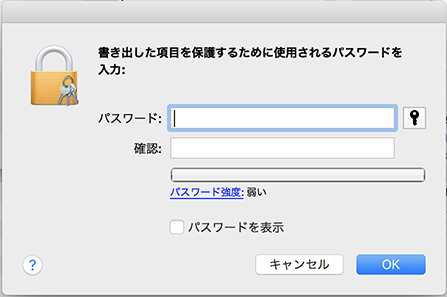

エクスポートした .p12 証明書のファイルとパスワードは APNS での認証に使用します。保存した場所を忘れないようにしてください。


### 3. App Serviceの環境構築

[Azure Portal](https://portal.azure.com) を使って App Serice を作成します。

１．[すべてのサービス] → [App Serivice] を選択します。検索で "App" などと入力すると見つけやすいです。

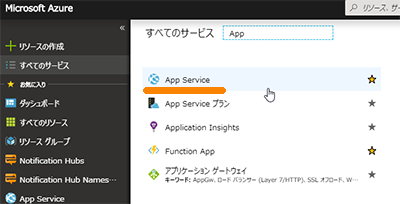

２．左上の [追加] → Web Apps カテゴリの [Web App] → [作成] と順番にクリックします。

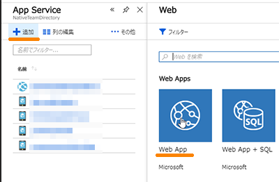

３．アプリ名やリソースグループなどを設定します。App Service プランは Free(F1) を選択してください。ここではアプリ名とリソースグループを `sample-notification` として作成しました。

- アプリ名
    - 設定値：Azure上で固有となる任意の文字列
- サブスクリプション
    - 設定値：任意のサブスクリプション
- [リソースグループ](https://docs.microsoft.com/ja-jp/azure/azure-resource-manager/resource-group-overview#terminology)
    - 設定値：Azure上で固有となる任意の文字列
- OS
    - 設定値：Windows
- [App Service プラン](https://docs.microsoft.com/ja-jp/azure/app-service/azure-web-sites-web-hosting-plans-in-depth-overview)
    - プラン名
        - 設定値：任意の文字列
    - 場所
        - 設定値：任意の場所
    - [価格レベル](https://azure.microsoft.com/ja-jp/pricing/details/app-service/windows/)
        - 設定値：F1


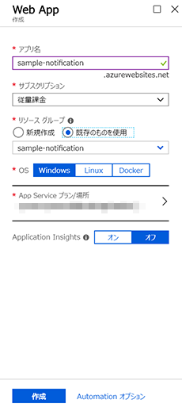

これで App Service の環境が構築されました。


### 4. Notification Hubの環境構築


Azure App Service は Azure Notification Hubs を使用して（経由して）プッシュ通知を送信します。
そのための設定を App Service の通知ハブから構成を設定します。

１．[Azure Portal](http://portal.azure.com) から [App Service] を選択します。

２．上で作成した `sample-notification` （Web アプリ）を選択します。

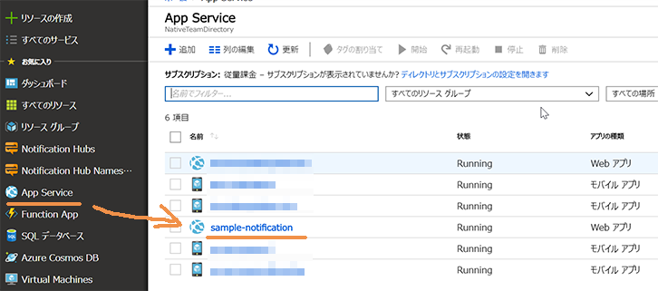

３．[設定] → [プッシュ] → [接続] を選択します。

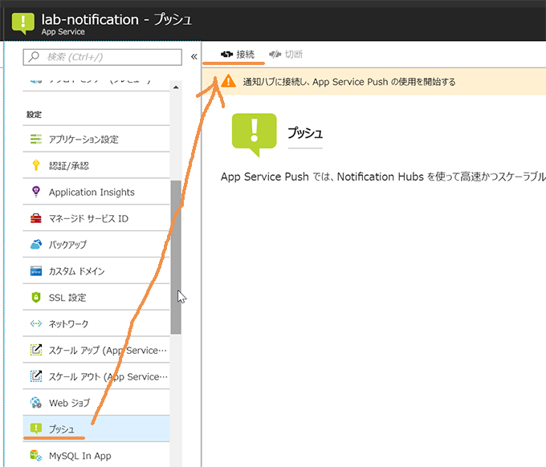

４．[+] をクリックし、通知ハブのリソースを設定します。[Notification Hub] ハブ名-dev（開発用）[Create a new namespace] は ハブ名-ns としておくとわかりやすいです。[Pricing tier] は Free 選択します。

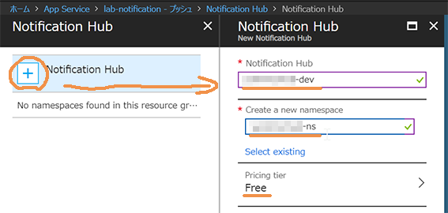

５．OK で通知ハブが Azure 上に構成されます。

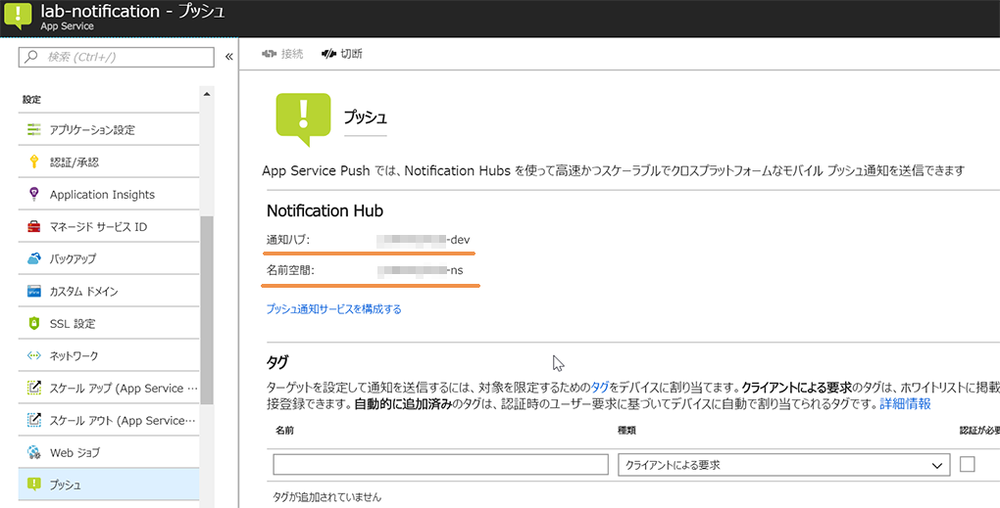


APNS 用に通知ハブを構成するために、先ほどの証明書（.p12）ファイルを App Service に登録します。

６．[設定] → [プッシュ] → [プッシュ通知サービスを構成する] をクリックします。iOS は [設定] → [通知] → [アプリ名] で設定を変更できます。

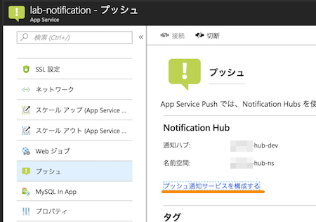

７．Apple(APNS) を選択し、

- [Certificate] をチェック
- 証明書ファイルを選択
- 証明書ファイルを作成時に入力したパスワードを入力
- [Sandbox] をクリック
- [Save] をクリック します。

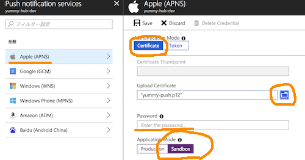

これで APNS(Apple) と Azure Notification Hubs との連携が構成されました。

Firebase も同様に Azure Notification Hubs と連携していきましょう。

８．[Google (GCM)] をクリックして、 Firebase コンソールから取得した [以前のサーバーキー] を入力し、[Save] をクリックします。

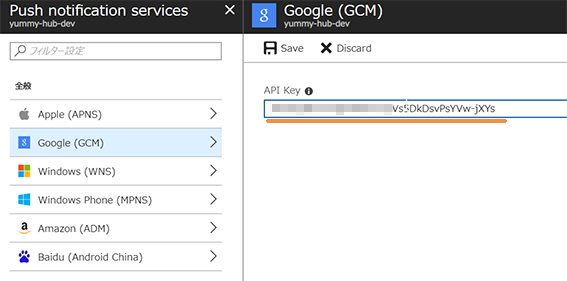

これで Firebase(FCM) と Azure Notification Hubs との連携が構成されました。

### 6. リポジトリのクローン

構築した環境で動作させるサンプルアプリを入手しましょう。以下のコマンドを実行して、ソースコードが格納されているリポジトリを取得します。

```
git clone http://gitlab.wadatsumi.dat.css.fujitsu.com/Mobile-Community/SampleGallery/PushNotification-Xamarin-DotNetCore-Azure.git
```

以降の作業では、これまで構築してきた環境でサンプルアプリを動作させるために、設定を変更する作業を行います。

### 7. 自分の環境用にフロントエンド資産の設定を書き換える（iOS プロジェクト）


#### アプリケーションのプロビジョニングプロファイルを生成する
プロビジョニングプロファイルとは、アプリケーションID、デバイス識別子、正規開発者証明書の関係をまとめたファイルで、開発中（やアドホック用）のアプリを、iPhone / iPad の実機にインストールするために必要です。プロビジョニングプロファイルを実機に登録しておくことで、条件にあったアプリをインストールすることが可能になります。

１． [ADP](https://developer.apple.com/account/) で [Certificates, Identifiers & Profiles] → [Provisioning Profiles] → [Development] を選択してから [+] ボタンをクリックします。

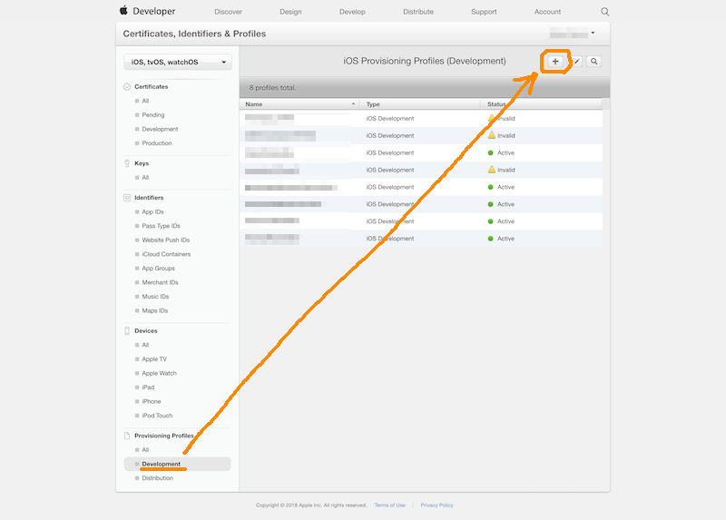

２．[iOS App Development] をチェックして [Continue] をクリックします。

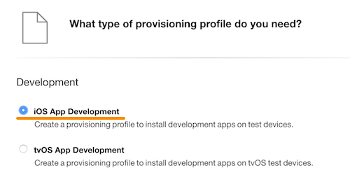

３．作成した App ID を選択し、 [Continue] をクリックします。

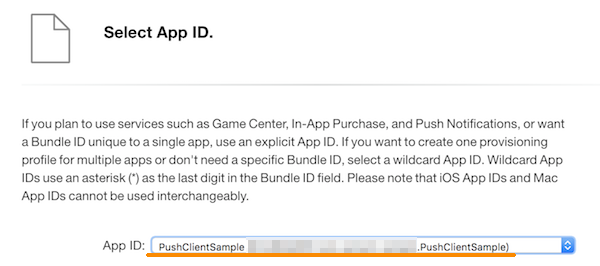

４．アプリをインストールする Developer を選択して [Continue] をクリックします。

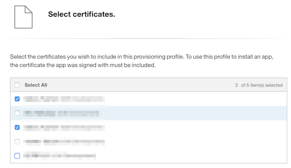

５．アプリをインストールするデバイスを選択して [Continue] をクリックします。

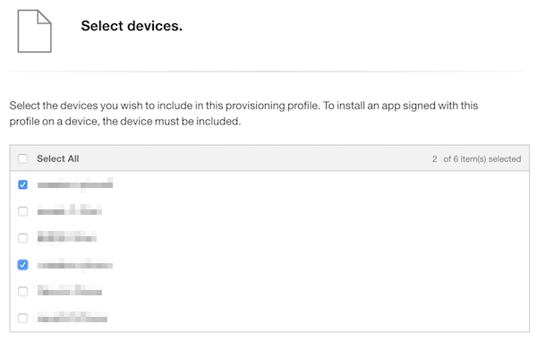

６．任意の名前を入力して [Continue] をクリックします。開発用やアドホックなど区別がつく名前にしておくのが望ましいです。

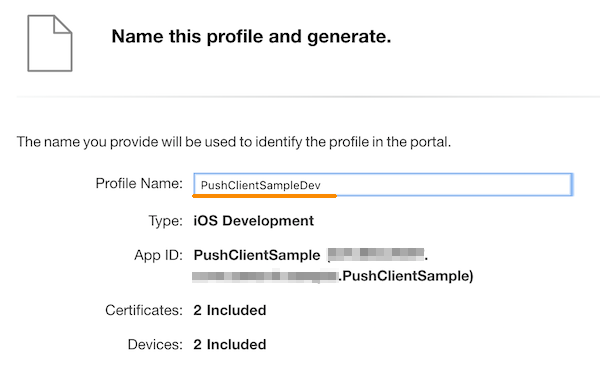

７．プロビジョニングプロファイルが作成されたので、ダウンロードしインストールします（ダウンロードしたファイルをダブルクリックすると Xcode が起動してインストールを実行します）。

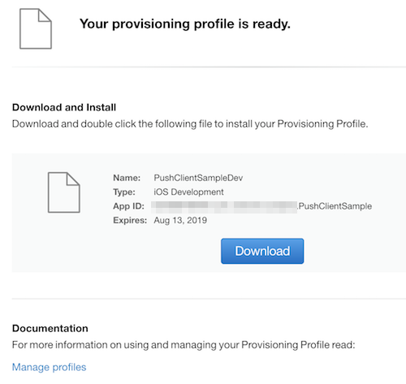

８．作成したプロビジョニングプロファイルが Active（緑色） であることを確認します。

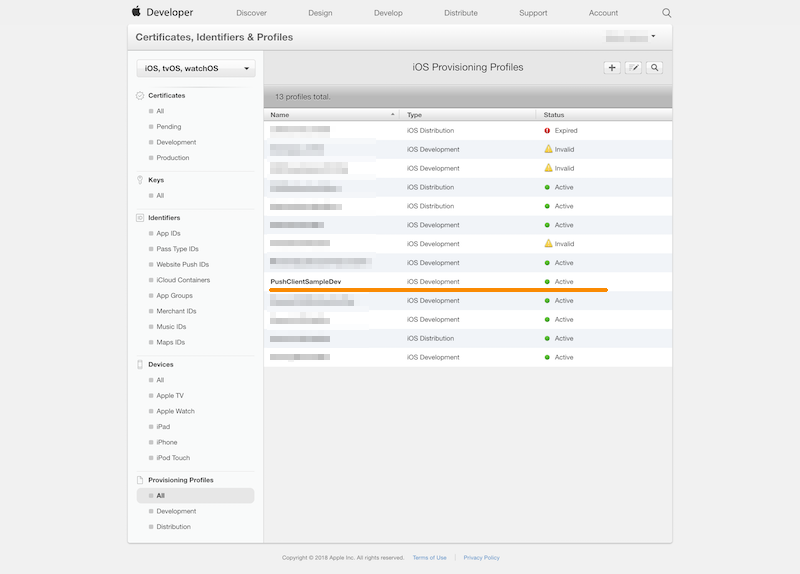

これでプロビジョニングファイルの登録が完了しました。


９．Bundle Identifierの設定

Visual Studio For Mac(以下VS4M) で `client/PushSample.sln` を開き、iOS プロジェクトの `info.plist` をダブルクリックします。バンドル識別子に作成した Bundle Identier を入力します。

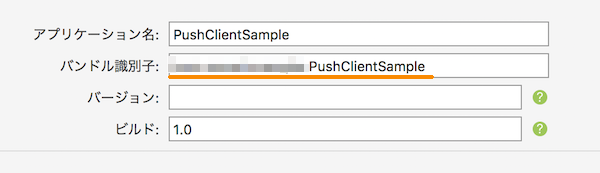

10．[バックグラウンドモード] セクションの [バックグラウンドモードを有効にする] と [リモート通知] をチェックします。

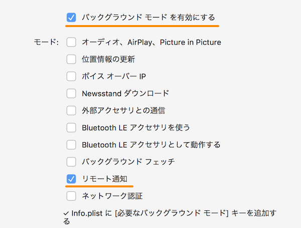

11．iOS のプロジェクトを選択して右クリック→プロパティをクリック（または `info.plist` → [Sigining] セクションの [iOS Bundle Setting] をクリック）します。[iOS バンドル署名] をクリックし、開発者（自動）→作成したプロビジョニングプロファイルを選択します（自動でもOK）。

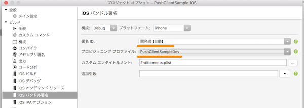


### 8. 自分の環境用にフロントエンド資産の設定を書き換える（Android プロジェクト）

１．`google-services.json` の登録

Visual Studio で `client/PushSample.sln` を開き、Android プロジェクトに FCM でダウンロードした `google-services.json` ファイルを（ダミーのファイルがプロジェクトには含まれているので）上書きします。`google-services.json` のプロパティ→ビルドアクションが `GoogleServiceJson` に設定されていることを確認します。

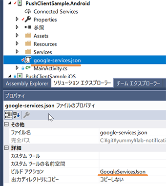

２．`AndroidManifest.xml` の修正

`AndroidManifest.xml` ファイルを開き、次の `<manifest>` タグの `package` プロパティを FCM で作成した Android パッケージ名に修正します。
```xml
<?xml version="1.0" encoding="utf-8"?>
<manifest xmlns:android="http://schemas.android.com/apk/res/android" android:versionCode="1" android:versionName="1.0" package="dummy.PushSample" android:installLocation="auto">
    <uses-sdk android:minSdkVersion="17" />
    <uses-permission android:name="android.permission.INTERNET" />
    <application android:label="PushSample.Android">
        <receiver android:name="com.google.firebase.iid.FirebaseInstanceIdInternalReceiver" android:exported="false" />
        <receiver android:name="com.google.firebase.iid.FirebaseInstanceIdReceiver" android:exported="true" android:permission="com.google.android.c2dm.permission.SEND">
            <intent-filter>
                <action android:name="com.google.android.c2dm.intent.RECEIVE" />
                <action android:name="com.google.android.c2dm.intent.REGISTRATION" />
                <category android:name="${applicationId}" />
            </intent-filter>
        </receiver>
    </application>
</manifest>
```


### 9. 自分の環境用にフロントエンド資産の設定を書き換える（共有プロジェクト）

１．`Constant.cs` の修正

Visual Studio で `client/PushSample.sln` を開き、共通プロジェクト（PushSample）の `Constants/Constant.cs` の値をそれぞれ Azure Portal を参照して書き換えます。

|説明|appsettings.json|Azure Portal での場所|
|-|-|-|
|接続文字列|ListenConnectionString|[Notification Hubs] → [Access Policies]→[DefaultListenSharedAccessSignature] (※)|
|通知ハブの名前|NotificationHubName|[Notification Hubs] → [Properties] → [Name]|
|App Service の URL|AppServiceUrl|[App Service] → 対象の Web アプリ → [概要] → [URL]|

※ バックエンドは DefaultFullSharedAccessSignature 、クライアントは DefaultListenSharedAccessSignature の値を使用します。


Constant.cs（抜粋）
```cs
/// <summary>
/// プッシュ通知
/// </summary>
public static class Push
{
    /// <summary>
    /// ConnectionString
    /// </summary>
    public const string ListenConnectionString = "{ListenConnectionString}";

    /// <summary>
    /// HubName
    /// </summary>
    public const string NotificationHubName = "{NotificationHubName}";

    /// <summary>
    /// tags
    /// </summary>
    public static class Tags
    {
        /// <summary>
        /// ユーザー名登録時の接頭辞
        /// </summary>
        public const string UserNamePrefix = "username:";
    }
}

/// <summary>
/// API Path
/// </summary>
public static class Api
{
    /// <summary>
    /// プッシュ通知送信APIのURL
    /// </summary>
    public const string NotificationUrl = "{AppServiceUrl}";
}
```


### 10. 自分の環境用にバックエンド資産を書き換える

１．`appsettings.json` の修正

Visual Studio で `service/PushSampleService.sln` を開き、 `appsettings.json` ファイルの `AppSettings` の値をそれぞれ Azure Portal を参照して書き換えます。

|説明|appsettings.json|Azure Portal での場所|
|-|-|-|
|接続文字列|NotificationHubConnectionString|[Notification Hubs] → [Access Policies]→[DefaultFullSharedAccessSignature] (※)|
|通知ハブの名前|NotificationHubName|[Notification Hubs] → [Properties] → [Name]|

※ バックエンドは DefaultFullSharedAccessSignature 、クライアントは DefaultListenSharedAccessSignature の値を使用します。

appsettings.json（抜粋）
```json
"AppSettings": {
    "NotificationHubConnectionString": "{notificationHubConnectionString}",
    "NotificationHubName": "{notificationHubName}"
  },
```


### 11. バックエンド資産を App Service に配置する

Visual Studio で `service/PushSampleService.sln` を開き、[プロパティ] → [発行] をクリックします。

１．[発行先を選択] → [既存のものを選択] → [発行] をクリックします。

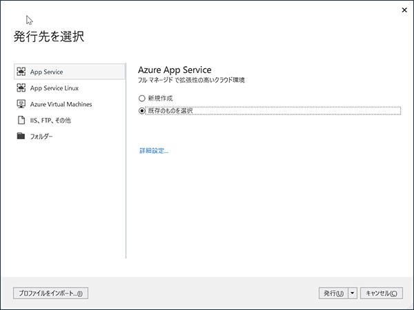

２．先ほど作成した [サブスクリプション] → App Service（sample-notification） を選択して、OK をクリックします。配置が正常に完了するとブラウザが起動します。

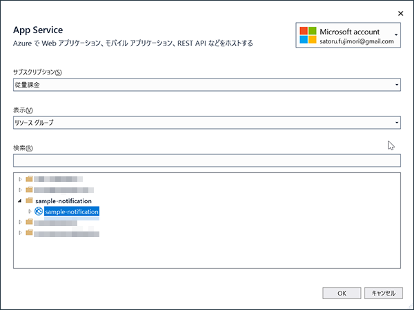

再度プロジェクトを配置する場合は [発行] ボタンをクリックするだけです。

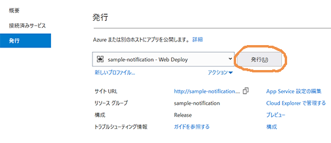


### 12. プッシュ通知受信の確認をする

Android プロジェクトをデバッグ起動し、Android エミュレータでプッシュ通知の受信を確認します。

- Visual Studio で `PushSample.Android` → 任意のエミュレータをクリックします。
- Android エミュレータが起動します。
- アプリが起動したらメッセージを入力して [全体通知] をタップします。
- バックエンドから通知が送られてきてプッシュ通知を受信します。

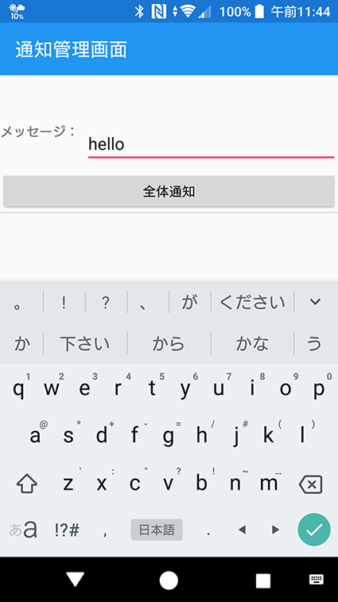

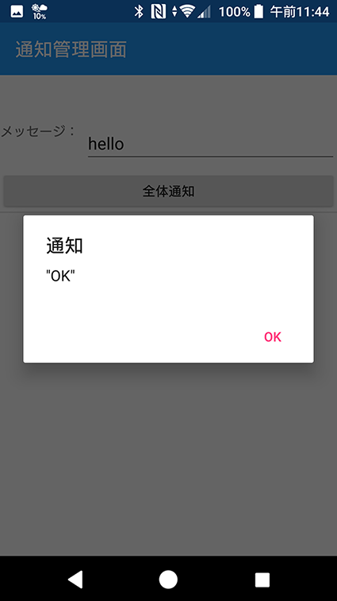

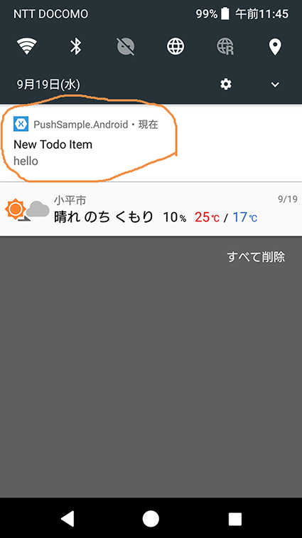

これでプッシュ通知の環境構築と動作確認が完了しました。

## プッシュ通知のハマりどころ

### Notification Hubs と Apple(APNs) を連携設定時の証明書登録に失敗する

Notification Hubs と Apple(APNs) を連携設定時に、以下のようなエラーメッセージが表示されて証明書登録に失敗することがあります。

> Failed to validate credentials with APNS. A call to SSPI failed, see inner exception

この現象が見られた場合は、誤った証明書を登録しょうとしている可能性が高いです。 登録しようとしている証明書が、プッシュ通知用の証明書か再度確認しましょう。証明書が合っているのに登録できない場合は、証明書作成の手順を再確認して、証明書を作り直してみましょう。
